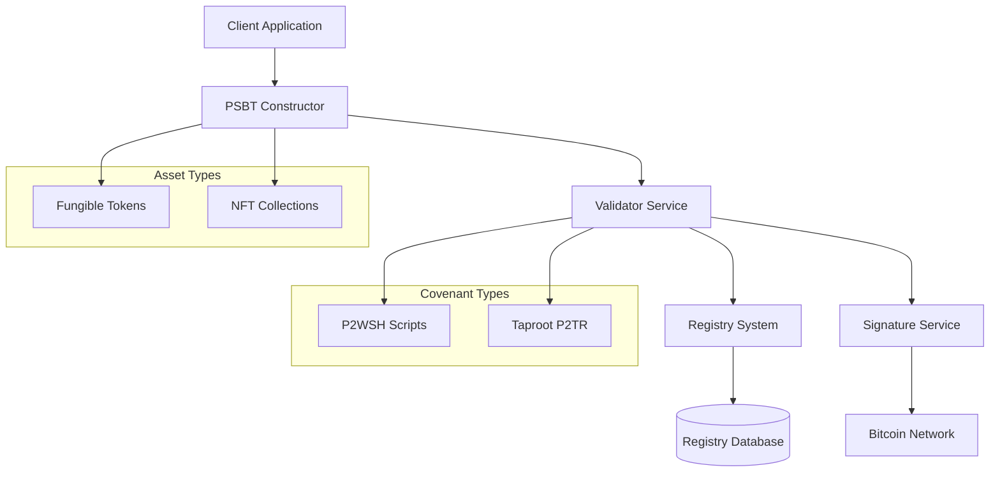

# Bitcoin Native Asset Protocol (BNAP)

Welcome to the Bitcoin Native Asset Protocol documentation. BNAP enables the creation and management of fungible tokens and NFTs directly on the Bitcoin blockchain using colored outputs and covenant-based validation.

## What is BNAP?

BNAP (Bitcoin Native Asset Protocol) is a comprehensive system for issuing and managing digital assets on Bitcoin. It uses a colored outputs approach where assets are represented by Bitcoin UTXOs with embedded metadata, validated by cryptographic covenants.

### Key Features

- **🪙 Fungible Token Issuance**: Create colored coin assets with configurable supply caps and mint limits
- **🖼️ NFT Creation**: Unique digital collectibles with content hash binding and collection management  
- **🔒 Dual Covenant Support**: Compatible with both Taproot (P2TR) and P2WSH script types
- **⚡ Bitcoin Native**: All transactions are standard Bitcoin transactions - no altcoins or sidechains
- **🛡️ Cryptographic Security**: Merkle proof allowlists and validator-signed authorizations

### Architecture Overview

## Quick Start

Get started with BNAP in minutes:

1. **[Install BNAP](deployment/installation.md)** - Set up the validator and CLI tools
2. **[Configure Bitcoin Node](deployment/bitcoin-node.md)** - Connect to regtest, testnet, or mainnet
3. **[Create Your First Asset](guides/getting-started.md)** - Issue a fungible token or NFT
4. **[Explore Examples](api/examples.md)** - See common integration patterns

## Use Cases

### Fungible Tokens
- **Supply-Capped Tokens**: Create tokens with maximum supply limits
- **Allowlist Distribution**: Restrict minting to verified addresses using Merkle proofs
- **Corporate Shares**: Represent equity or voting rights on Bitcoin
- **Reward Points**: Loyalty programs and gamification systems

### NFT Collections
- **Digital Art**: Provably scarce artwork with content integrity verification
- **Collectibles**: Trading cards, virtual items, and memorabilia
- **Certificates**: Academic credentials, professional certifications
- **Event Tickets**: Verifiable admission tokens for events

## System Components

| Component | Purpose | Documentation |
|-----------|---------|---------------|
| **Registry** | Asset definitions and state tracking | [Technical Docs](technical/architecture.md) |
| **Validator** | Transaction signing and rule enforcement | [API Reference](api/python.md) |
| **PSBT Builder** | Transaction construction utilities | [User Guide](guides/cli-reference.md) |
| **CLI Tools** | Command-line interface for operations | [Installation](deployment/installation.md) |

## Bitcoin Network Compatibility

BNAP works across all Bitcoin networks:

- **Regtest**: Development and testing environment
- **Testnet**: Public testing with test bitcoins  
- **Mainnet**: Production Bitcoin network

All BNAP transactions are standard Bitcoin transactions that can be broadcast by any Bitcoin node or wallet.

## Getting Help

- **[FAQ](reference/faq.md)** - Common questions and answers
- **[Troubleshooting](operations/troubleshooting.md)** - Debugging guide for common issues
- **[GitHub Issues](https://github.com/bnap/bnap/issues)** - Report bugs or request features
- **[Community Discord](https://discord.gg/bnap)** - Real-time support and discussions

## Contributing

BNAP is open source and welcomes contributions:

- **[Development Guide](technical/architecture.md)** - Technical architecture and design patterns
- **[API Documentation](api/overview.md)** - Integration reference for developers  
- **[Test Suite](reference/test-vectors.md)** - Comprehensive testing methodology

---

*Ready to build on Bitcoin? Start with our [Getting Started Guide](guides/getting-started.md).*