# BNAP System Architecture

The Bitcoin Native Asset Protocol (BNAP) is a comprehensive system for issuing and managing digital assets directly on the Bitcoin blockchain. This document provides detailed technical architecture documentation based on the actual implementation.

## System Overview

BNAP uses a **colored outputs** approach where assets are represented by Bitcoin UTXOs with embedded metadata. The system employs a centralized validator (designed to expand to multi-signature quorum) that authorizes mints by signing transactions that meet predefined rules.

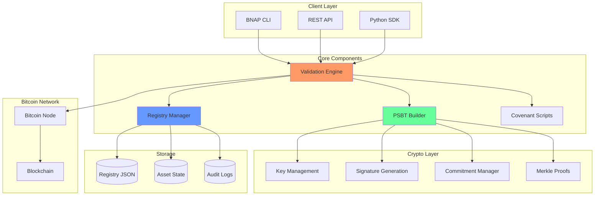

## Core Components

### 1. Validation Engine (`validator/core.py`)

The ValidationEngine orchestrates all validation operations and serves as the central coordinator.

**Key Features:**
- Asset rule enforcement
- Supply limit validation  
- Per-mint cap checking
- Allowlist verification via Merkle proofs
- NFT content hash validation
- PSBT signing authorization

**Validation Flow:**
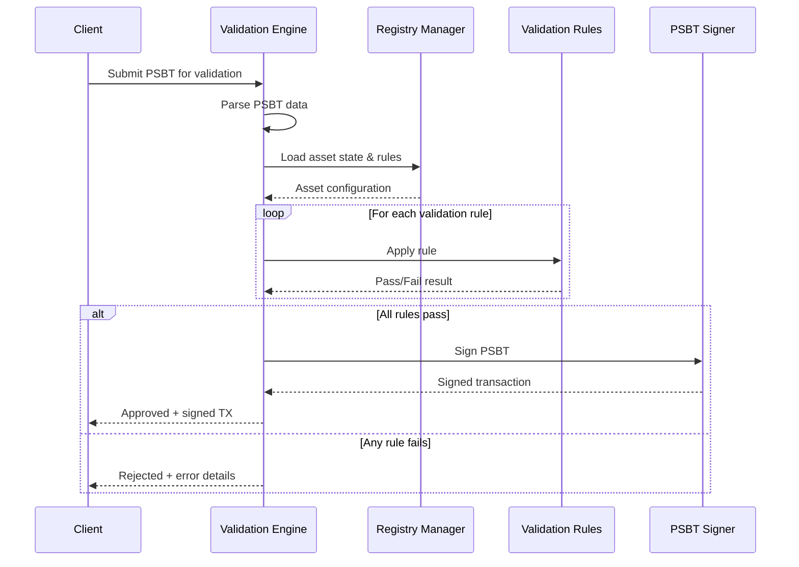

### 2. Registry Manager (`registry/manager.py`)

Manages asset definitions, state tracking, and configuration persistence.

**Schema Models** (`registry/schema.py`):
- `FungibleAsset`: Tokens with supply caps and mint limits
- `NFTAsset`: Unique collectibles with content hash binding
- `ValidatorConfig`: Signing authority configuration
- `StateEntry`: Real-time asset state tracking

**Asset Registration:**
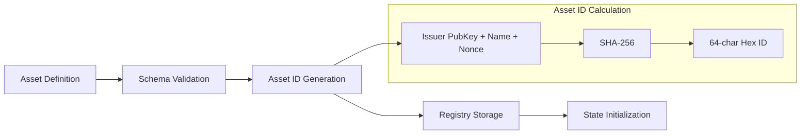

### 3. PSBT Builder (`psbt/builder.py`)

Constructs Partially Signed Bitcoin Transactions with BNAP-specific metadata.

**Transaction Structure:**
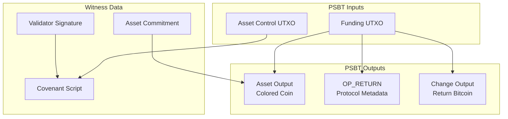

### 4. Cryptographic Primitives (`crypto/`)

#### Key Management (`crypto/keys.py`)
- **BIP32/BIP39**: Hierarchical deterministic key derivation
- **Taproot Support**: P2TR key tweaking for asset commitments
- **Multi-format**: Support for legacy, SegWit, and Taproot addresses

#### Asset Commitments (`crypto/commitments.py`)
Asset commitments are cryptographic proofs embedded in Bitcoin outputs:

```python
# Taproot asset commitment formula
P_output = P_internal + H(asset_commitment) * G

# Where:
# P_internal = internal public key
# H() = tagged hash function
# asset_commitment = asset_id || amount || metadata
# G = secp256k1 generator point
```

#### Merkle Proofs (`crypto/merkle.py`)
Allowlist verification using Merkle trees:

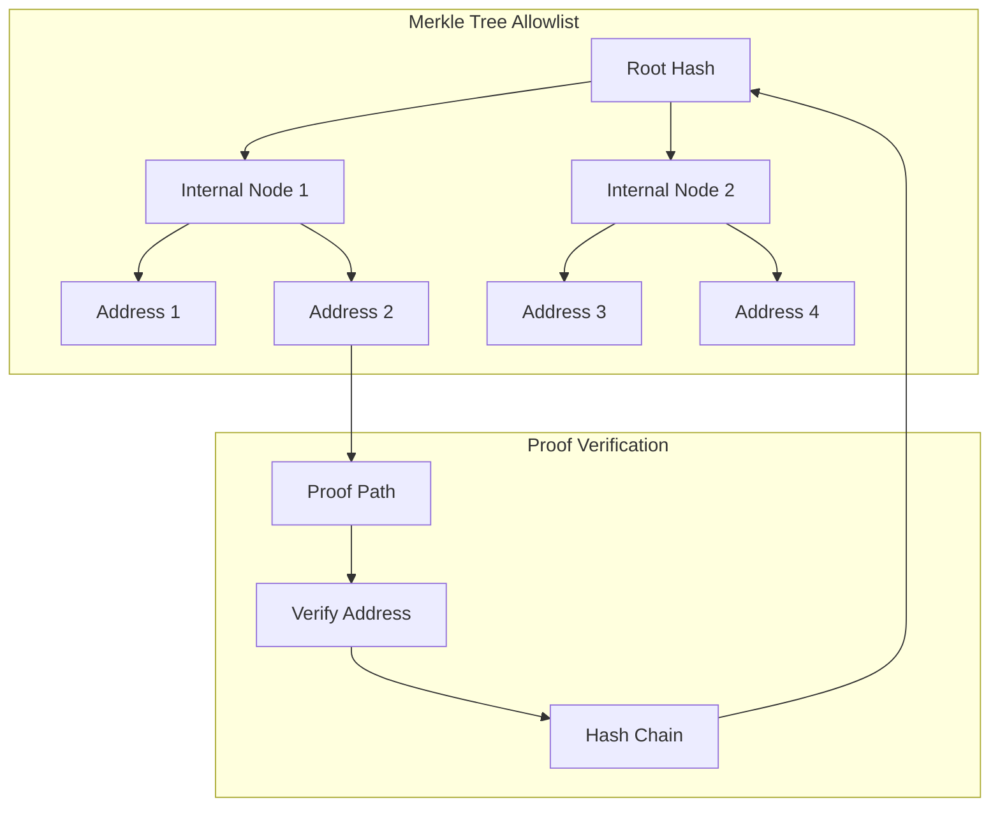

## Covenant Implementations

### Taproot Covenant (P2TR)

**Privacy-focused approach** using key path spending:

```python
# Taproot script-path (covenant enforcement)
def taproot_covenant_script():
    return [
        OP_DUP,           # Duplicate asset commitment
        OP_HASH256,       # Hash the commitment  
        <commitment_hash>, # Expected commitment hash
        OP_EQUALVERIFY,   # Verify commitment matches
        <validator_pubkey>, # Validator public key
        OP_CHECKSIG       # Verify validator signature
    ]
```

**Key Derivation:**
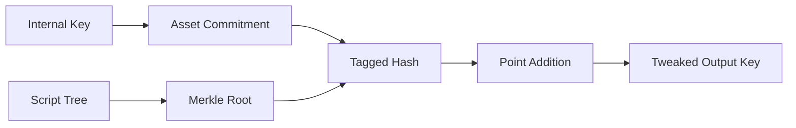

### P2WSH Covenant

**Transparent approach** with explicit witness scripts:

```python
# P2WSH covenant script
def p2wsh_covenant_script():
    return [
        # Asset amount validation
        OP_DUP,
        OP_SIZE,
        <8>,              # 8-byte amount
        OP_EQUALVERIFY,
        
        # Supply limit check
        <current_supply>,
        OP_ADD,
        <max_supply>,
        OP_LESSTHANOREQUAL,
        OP_VERIFY,
        
        # Validator signature
        <validator_pubkey>,
        OP_CHECKSIG
    ]
```

## Transaction Formats

### Fungible Token Mint

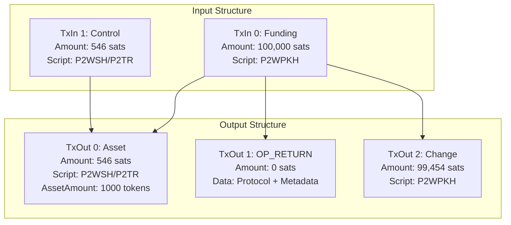

### NFT Mint

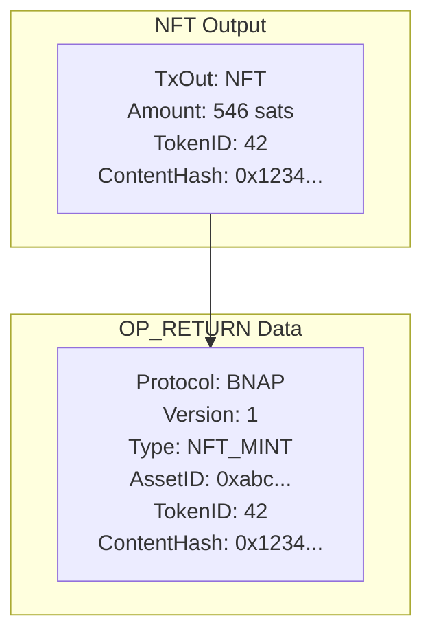

## Asset State Management

### State Tracking Schema

```python
@dataclass
class StateEntry:
    asset_id: str
    minted_supply: int = 0
    last_mint_timestamp: Optional[datetime] = None
    transaction_count: int = 0
    transaction_history: List[TransactionEntry] = field(default_factory=list)
    issued_nft_ids: List[int] = field(default_factory=list)  # NFT only
```

### Concurrency Handling (`registry/concurrency.py`)

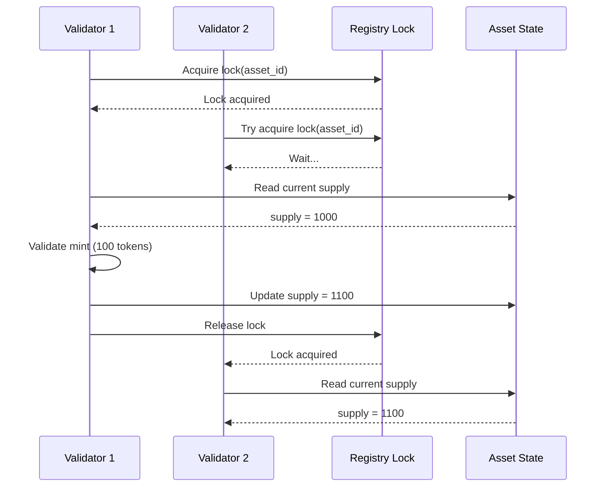

## Network Integration

### Bitcoin RPC Integration (`network/rpc.py`)

**Connection Management:**
```python
class BitcoinRPC:
    def __init__(self, config):
        self.host = config.get('rpc_host', 'localhost')
        self.port = config.get('rpc_port', 18443)  # regtest default
        self.user = config.get('rpc_user')
        self.password = config.get('rpc_password')
    
    def broadcast_transaction(self, tx_hex: str) -> str:
        """Broadcast signed transaction to Bitcoin network."""
        return self.call('sendrawtransaction', [tx_hex])
```

### Transaction Broadcasting (`network/broadcaster.py`)

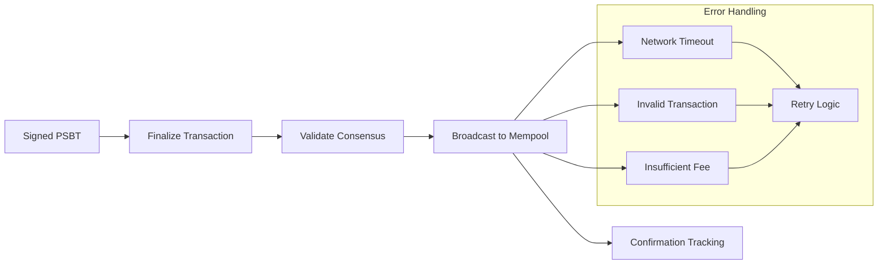

## CLI Architecture (`cli/`)

### Command Structure

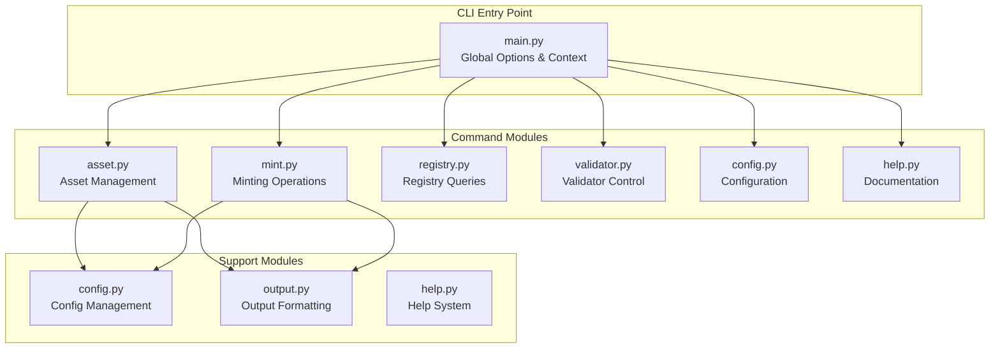

### Output Formatting (`cli/output.py`)

Supports multiple output formats:
- **Table**: Human-readable tabular data
- **JSON**: Machine-readable structured data
- **YAML**: Configuration-friendly format
- **CSV**: Spreadsheet-compatible export
- **Template**: Custom Jinja2 templates

## Security Model

### Validator Security

**Key Storage:**
- Private keys stored in encrypted configuration
- Hardware Security Module (HSM) support planned
- Multi-signature expansion ready

**Access Control:**
```python
class ValidatorConfig:
    validator_id: str
    pubkey: str  
    signing_scheme: SigningScheme  # ECDSA | SCHNORR
    permissions: List[str]  # Asset operations allowed
    is_active: bool
```

### Audit Logging (`validator/audit_logger.py`)

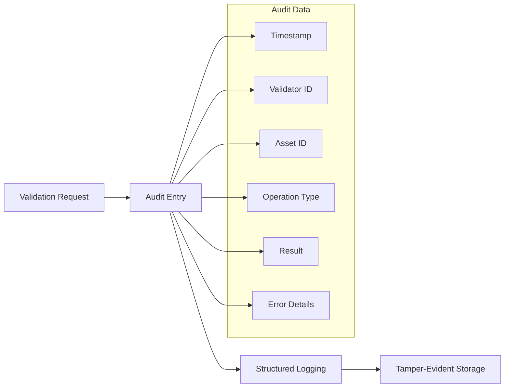

## Performance Characteristics

### Benchmarks

| Operation | Latency | Throughput |
|-----------|---------|------------|
| PSBT Validation | < 100ms | 50+ TPS |
| Signature Generation | < 50ms | 100+ TPS |
| Registry Query | < 10ms | 1000+ QPS |
| Merkle Proof Verify | < 5ms | 2000+ TPS |

### Scalability Considerations

**Bottlenecks:**
- Registry file I/O for state updates
- Bitcoin RPC calls for broadcast
- Cryptographic operations (signing)

**Optimizations:**
- In-memory state caching
- Batch transaction processing  
- Async I/O for network operations
- Connection pooling for Bitcoin RPC

## Development Workflow

### Testing Strategy

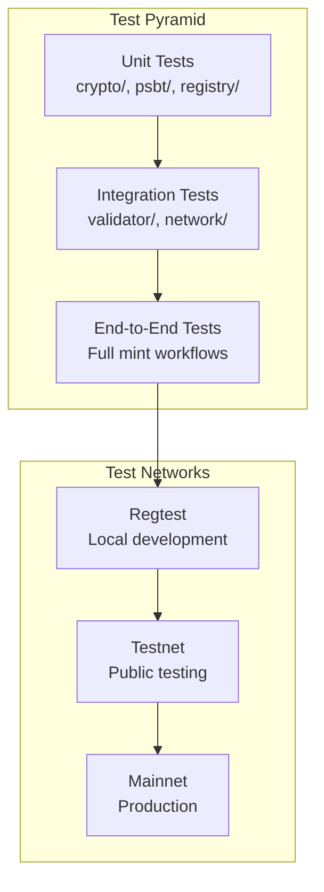

### CI/CD Pipeline

1. **Code Quality**: Linting, type checking, security scan
2. **Unit Testing**: Component-level validation
3. **Integration Testing**: Cross-component workflows
4. **Performance Testing**: Benchmark validation
5. **Security Testing**: Vulnerability assessment
6. **Documentation**: Auto-generated API docs

This architecture supports the MVP requirements while providing a foundation for future multi-validator consensus mechanisms and enhanced scalability.