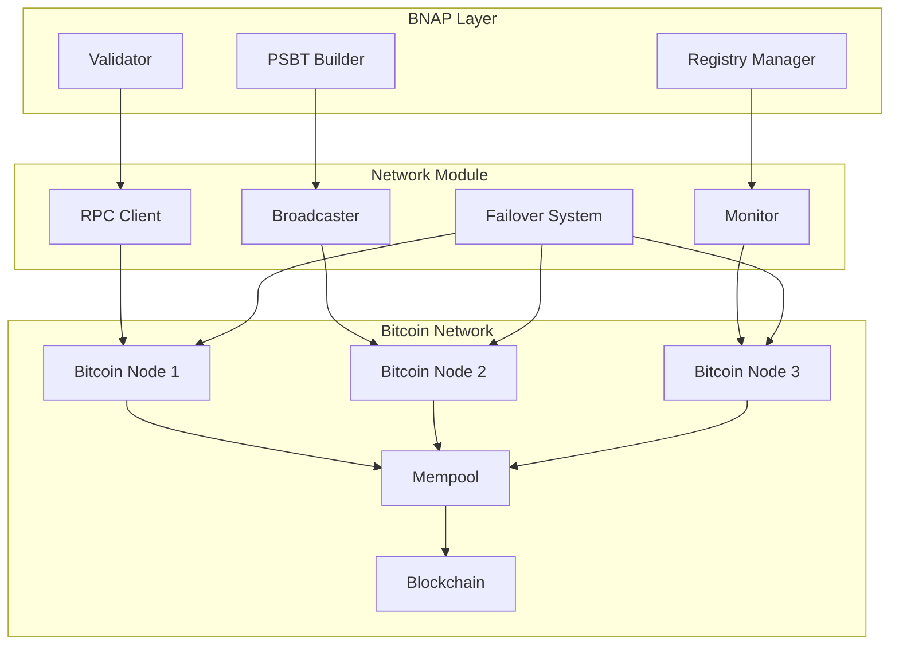

# Network Protocol Integration

This document describes how BNAP integrates with the Bitcoin network protocol, manages node connections, and handles transaction broadcasting, based on the implementation in the `network/` module.

## Overview

BNAP operates as a layer built on top of the Bitcoin protocol, utilizing standard Bitcoin network features:

- **Bitcoin RPC**: Communication with Bitcoin Core nodes
- **P2P Network**: Transaction broadcasting and validation
- **Mempool Management**: Unconfirmed transaction tracking
- **Block Monitoring**: Confirmation and reorganization handling

## Network Architecture



## Bitcoin RPC Integration (`network/rpc.py`)

### Connection Management

```python
class BitcoinRPC:
    """Bitcoin Core RPC client with connection pooling and retry logic."""
    
    def __init__(self, config: Dict[str, Any]):
        self.host = config.get('rpc_host', 'localhost')
        self.port = config.get('rpc_port', 8332)
        self.user = config.get('rpc_user')
        self.password = config.get('rpc_password')
        self.timeout = config.get('rpc_timeout', 30)
        self.max_retries = config.get('max_retries', 3)
        
        # Connection pool
        self.session = requests.Session()
        adapter = HTTPAdapter(
            max_retries=Retry(
                total=self.max_retries,
                backoff_factor=0.5,
                status_forcelist=[500, 502, 503, 504]
            ),
            pool_connections=10,
            pool_maxsize=20
        )
        self.session.mount('http://', adapter)
        self.session.mount('https://', adapter)
        
        # Authentication
        self.session.auth = (self.user, self.password)
        
        self.logger = logging.getLogger(__name__)
    
    def call(self, method: str, params: List[Any] = None) -> Any:
        """Make RPC call to Bitcoin node."""
        if params is None:
            params = []
        
        payload = {
            'jsonrpc': '2.0',
            'id': str(uuid.uuid4()),
            'method': method,
            'params': params
        }
        
        url = f"http://{self.host}:{self.port}/"
        
        try:
            response = self.session.post(
                url,
                json=payload,
                timeout=self.timeout,
                headers={'Content-Type': 'application/json'}
            )
            response.raise_for_status()
            
            result = response.json()
            
            if 'error' in result and result['error']:
                raise RPCError(result['error']['message'], result['error']['code'])
            
            return result.get('result')
            
        except requests.RequestException as e:
            self.logger.error(f"RPC request failed: {e}")
            raise NetworkError(f"Failed to connect to Bitcoin node: {e}")
        except ValueError as e:
            self.logger.error(f"Invalid JSON response: {e}")
            raise RPCError(f"Invalid response from Bitcoin node: {e}")
```

### Network Detection

```python
def detect_network(rpc_client: BitcoinRPC) -> str:
    """Detect which Bitcoin network we're connected to."""
    try:
        blockchain_info = rpc_client.call('getblockchaininfo')
        return blockchain_info['chain']
    except Exception:
        # Fallback to checking genesis block
        try:
            genesis_block = rpc_client.call('getblockhash', [0])
            
            network_genesis = {
                'mainnet': '000000000019d6689c085ae165831e934ff763ae46a2a6c172b3f1b60a8ce26f',
                'testnet': '000000000933ea01ad0ee984209779baaec3ced90fa3f408719526f8d77f4943',
                'regtest': '0f9188f13cb7b2c71f2a335e3a4fc328bf5beb436012afca590b1a11466e2206'
            }
            
            for network, genesis_hash in network_genesis.items():
                if genesis_block == genesis_hash:
                    return network
            
            return 'unknown'
            
        except Exception:
            return 'unknown'
```

### Core RPC Methods

```python
class BitcoinRPC:
    # ... previous implementation ...
    
    def get_blockchain_info(self) -> Dict[str, Any]:
        """Get blockchain information."""
        return self.call('getblockchaininfo')
    
    def get_network_info(self) -> Dict[str, Any]:
        """Get network information."""
        return self.call('getnetworkinfo')
    
    def send_raw_transaction(self, tx_hex: str) -> str:
        """Broadcast raw transaction to network."""
        return self.call('sendrawtransaction', [tx_hex])
    
    def get_raw_transaction(self, txid: str, verbose: bool = True) -> Dict[str, Any]:
        """Get raw transaction by ID."""
        return self.call('getrawtransaction', [txid, verbose])
    
    def get_transaction(self, txid: str) -> Dict[str, Any]:
        """Get wallet transaction by ID."""
        return self.call('gettransaction', [txid])
    
    def get_utxos(self, addresses: List[str]) -> List[Dict[str, Any]]:
        """Get UTXOs for addresses."""
        # Use scantxoutset for efficient UTXO scanning
        descriptors = [f"addr({addr})" for addr in addresses]
        result = self.call('scantxoutset', ['start', descriptors])
        return result.get('unspents', [])
    
    def get_mempool_info(self) -> Dict[str, Any]:
        """Get mempool information."""
        return self.call('getmempoolinfo')
    
    def get_raw_mempool(self, verbose: bool = False) -> Union[List[str], Dict[str, Any]]:
        """Get raw mempool contents."""
        return self.call('getrawmempool', [verbose])
    
    def estimate_fee(self, target_blocks: int = 6) -> float:
        """Estimate fee rate for target confirmation time."""
        try:
            # Try estimatesmartfee first (newer nodes)
            result = self.call('estimatesmartfee', [target_blocks])
            if 'feerate' in result:
                return result['feerate']
        except RPCError:
            pass
        
        try:
            # Fallback to estimatefee (older nodes)
            return self.call('estimatefee', [target_blocks])
        except RPCError:
            # Default fallback
            return 0.00001  # 1 sat/byte
```

## Transaction Broadcasting (`network/broadcaster.py`)

### Broadcasting Strategy

```python
class TransactionBroadcaster:
    """Handles transaction broadcasting with retry logic and monitoring."""
    
    def __init__(self, rpc_clients: List[BitcoinRPC], config: Dict[str, Any]):
        self.rpc_clients = rpc_clients
        self.max_retries = config.get('broadcast_retries', 3)
        self.retry_delay = config.get('retry_delay', 5)  # seconds
        self.confirmation_timeout = config.get('confirmation_timeout', 3600)  # 1 hour
        
        self.pending_broadcasts = {}
        self.logger = logging.getLogger(__name__)
    
    def broadcast_transaction(self, tx_hex: str, tx_id: str = None) -> BroadcastResult:
        """Broadcast transaction to Bitcoin network."""
        if tx_id is None:
            tx_id = self._calculate_txid(tx_hex)
        
        self.logger.info(f"Broadcasting transaction {tx_id}")
        
        # Try each RPC client
        errors = []
        for i, rpc_client in enumerate(self.rpc_clients):
            try:
                result_txid = rpc_client.send_raw_transaction(tx_hex)
                
                if result_txid == tx_id:
                    self.logger.info(f"Successfully broadcast {tx_id} via node {i}")
                    
                    # Track for confirmation monitoring
                    self.pending_broadcasts[tx_id] = {
                        'tx_hex': tx_hex,
                        'broadcast_time': datetime.utcnow(),
                        'rpc_client': rpc_client
                    }
                    
                    return BroadcastResult(
                        success=True,
                        tx_id=tx_id,
                        node_index=i,
                        broadcast_time=datetime.utcnow()
                    )
                else:
                    self.logger.warning(f"Transaction ID mismatch: expected {tx_id}, got {result_txid}")
                    
            except RPCError as e:
                error_msg = f"Node {i} rejected transaction: {e}"
                self.logger.warning(error_msg)
                errors.append(error_msg)
                
                # Check if transaction already exists
                if 'already in' in str(e).lower() or 'already exists' in str(e).lower():
                    self.logger.info(f"Transaction {tx_id} already in mempool/blockchain")
                    return BroadcastResult(
                        success=True,
                        tx_id=tx_id,
                        node_index=i,
                        already_exists=True
                    )
                
            except NetworkError as e:
                error_msg = f"Network error with node {i}: {e}"
                self.logger.error(error_msg)
                errors.append(error_msg)
        
        # All nodes failed
        self.logger.error(f"Failed to broadcast {tx_id} to any node")
        return BroadcastResult(
            success=False,
            tx_id=tx_id,
            errors=errors
        )
    
    def retry_failed_broadcasts(self):
        """Retry failed broadcasts with exponential backoff."""
        failed_txs = []
        
        for tx_id, broadcast_info in self.pending_broadcasts.items():
            # Check if transaction is confirmed
            if self._is_transaction_confirmed(tx_id, broadcast_info['rpc_client']):
                self.logger.info(f"Transaction {tx_id} confirmed, removing from pending")
                failed_txs.append(tx_id)
                continue
            
            # Check if broadcast timeout exceeded
            elapsed = datetime.utcnow() - broadcast_info['broadcast_time']
            if elapsed.total_seconds() > self.confirmation_timeout:
                self.logger.warning(f"Transaction {tx_id} broadcast timeout exceeded")
                
                # Retry broadcast
                result = self.broadcast_transaction(broadcast_info['tx_hex'], tx_id)
                if not result.success:
                    failed_txs.append(tx_id)
        
        # Remove completed/failed transactions
        for tx_id in failed_txs:
            del self.pending_broadcasts[tx_id]
```

### Broadcast Result Tracking

```python
@dataclass
class BroadcastResult:
    success: bool
    tx_id: str
    node_index: Optional[int] = None
    broadcast_time: Optional[datetime] = None
    confirmation_time: Optional[datetime] = None
    block_height: Optional[int] = None
    already_exists: bool = False
    errors: List[str] = field(default_factory=list)
    
    def to_dict(self) -> Dict[str, Any]:
        return {
            'success': self.success,
            'tx_id': self.tx_id,
            'node_index': self.node_index,
            'broadcast_time': self.broadcast_time.isoformat() if self.broadcast_time else None,
            'confirmation_time': self.confirmation_time.isoformat() if self.confirmation_time else None,
            'block_height': self.block_height,
            'already_exists': self.already_exists,
            'errors': self.errors
        }
```

## Network Monitoring (`network/monitor.py`)

### Transaction Monitoring

```python
class NetworkMonitor:
    """Monitors Bitcoin network for transaction confirmations and reorgs."""
    
    def __init__(self, rpc_client: BitcoinRPC, config: Dict[str, Any]):
        self.rpc_client = rpc_client
        self.confirmation_target = config.get('confirmation_target', 1)
        self.reorg_depth_limit = config.get('reorg_depth_limit', 6)
        self.poll_interval = config.get('poll_interval', 10)  # seconds
        
        self.tracked_transactions = {}
        self.last_block_height = 0
        self.last_block_hash = None
        
        self.logger = logging.getLogger(__name__)
        self._running = False
    
    def track_transaction(self, tx_id: str, callback: Callable[[str, int], None]):
        """Track transaction for confirmations."""
        self.tracked_transactions[tx_id] = {
            'callback': callback,
            'added_height': self.last_block_height,
            'confirmations': 0,
            'block_hash': None
        }
        self.logger.info(f"Now tracking transaction {tx_id}")
    
    def start_monitoring(self):
        """Start the monitoring loop."""
        self._running = True
        
        # Get initial blockchain state
        self._update_blockchain_state()
        
        while self._running:
            try:
                self._check_new_blocks()
                self._check_tracked_transactions()
                time.sleep(self.poll_interval)
                
            except Exception as e:
                self.logger.error(f"Monitor error: {e}")
                time.sleep(self.poll_interval)
    
    def stop_monitoring(self):
        """Stop the monitoring loop."""
        self._running = False
    
    def _check_new_blocks(self):
        """Check for new blocks and potential reorganizations."""
        try:
            current_height = self.rpc_client.call('getblockcount')
            
            if current_height > self.last_block_height:
                # New block(s) found
                for height in range(self.last_block_height + 1, current_height + 1):
                    block_hash = self.rpc_client.call('getblockhash', [height])
                    self._process_new_block(height, block_hash)
                
                self.last_block_height = current_height
                
            elif current_height < self.last_block_height:
                # Potential reorganization
                self.logger.warning(f"Potential reorg detected: height decreased from {self.last_block_height} to {current_height}")
                self._handle_reorganization(current_height)
                
        except Exception as e:
            self.logger.error(f"Error checking new blocks: {e}")
    
    def _process_new_block(self, height: int, block_hash: str):
        """Process a new block for tracked transactions."""
        try:
            block = self.rpc_client.call('getblock', [block_hash, 2])  # Full transaction data
            
            for tx in block['tx']:
                tx_id = tx['txid']
                
                if tx_id in self.tracked_transactions:
                    # Transaction confirmed
                    tracked = self.tracked_transactions[tx_id]
                    confirmations = height - tracked['added_height']
                    
                    self.logger.info(f"Transaction {tx_id} confirmed in block {height} ({confirmations} confirmations)")
                    
                    # Update tracking info
                    tracked['confirmations'] = confirmations
                    tracked['block_hash'] = block_hash
                    tracked['block_height'] = height
                    
                    # Call callback
                    try:
                        tracked['callback'](tx_id, confirmations)
                    except Exception as e:
                        self.logger.error(f"Callback error for {tx_id}: {e}")
                    
                    # Remove if sufficient confirmations
                    if confirmations >= self.confirmation_target:
                        del self.tracked_transactions[tx_id]
                        self.logger.info(f"Stopped tracking {tx_id} (sufficient confirmations)")
                        
        except Exception as e:
            self.logger.error(f"Error processing block {height}: {e}")
    
    def _handle_reorganization(self, new_height: int):
        """Handle blockchain reorganization."""
        self.logger.warning(f"Handling reorganization to height {new_height}")
        
        # Reset tracked transaction confirmations
        for tx_id, tracked in self.tracked_transactions.items():
            if tracked.get('block_height', 0) > new_height:
                # Transaction no longer confirmed
                tracked['confirmations'] = 0
                tracked['block_hash'] = None
                tracked['block_height'] = None
                
                self.logger.warning(f"Transaction {tx_id} unconfirmed due to reorg")
        
        self.last_block_height = new_height
        self._update_blockchain_state()
```

### Mempool Monitoring

```python
class MempoolMonitor:
    """Monitor mempool for fee estimation and transaction tracking."""
    
    def __init__(self, rpc_client: BitcoinRPC):
        self.rpc_client = rpc_client
        self.mempool_cache = {}
        self.fee_estimates = {}
        self.logger = logging.getLogger(__name__)
    
    def get_mempool_stats(self) -> Dict[str, Any]:
        """Get current mempool statistics."""
        try:
            mempool_info = self.rpc_client.get_mempool_info()
            raw_mempool = self.rpc_client.get_raw_mempool(verbose=True)
            
            # Calculate fee rate statistics
            fee_rates = []
            for tx_info in raw_mempool.values():
                if 'fees' in tx_info and 'size' in tx_info:
                    fee_rate = (tx_info['fees']['base'] * 100_000_000) / tx_info['size']  # sat/byte
                    fee_rates.append(fee_rate)
            
            fee_rates.sort()
            
            return {
                'transaction_count': mempool_info['size'],
                'total_size_bytes': mempool_info['bytes'],
                'memory_usage_mb': mempool_info['usage'] / (1024 * 1024),
                'fee_rates': {
                    'min': min(fee_rates) if fee_rates else 0,
                    'max': max(fee_rates) if fee_rates else 0,
                    'median': fee_rates[len(fee_rates)//2] if fee_rates else 0,
                    'p90': fee_rates[int(len(fee_rates)*0.9)] if fee_rates else 0,
                    'p95': fee_rates[int(len(fee_rates)*0.95)] if fee_rates else 0
                }
            }
            
        except Exception as e:
            self.logger.error(f"Error getting mempool stats: {e}")
            return {}
    
    def estimate_optimal_fee(self, target_blocks: int = 1) -> float:
        """Estimate optimal fee rate for target confirmation time."""
        try:
            # Get fee estimate from node
            node_estimate = self.rpc_client.estimate_fee(target_blocks)
            
            # Get mempool-based estimate
            mempool_stats = self.get_mempool_stats()
            mempool_estimate = mempool_stats.get('fee_rates', {}).get('p90', 0)
            
            # Convert to BTC/kB if needed
            if mempool_estimate > 1:  # Likely sat/byte
                mempool_estimate = mempool_estimate / 100_000  # Convert to BTC/kB
            
            # Use higher of the two estimates
            return max(node_estimate, mempool_estimate)
            
        except Exception as e:
            self.logger.error(f"Error estimating fee: {e}")
            return 0.00001  # Conservative fallback
```

## Connection Failover (`network/failover.py`)

### Multi-Node Failover

```python
class FailoverManager:
    """Manages failover between multiple Bitcoin nodes."""
    
    def __init__(self, node_configs: List[Dict[str, Any]]):
        self.nodes = [BitcoinRPC(config) for config in node_configs]
        self.current_node_index = 0
        self.node_health = [True] * len(self.nodes)
        self.health_check_interval = 60  # seconds
        self.last_health_check = 0
        
        self.logger = logging.getLogger(__name__)
    
    def get_healthy_node(self) -> Optional[BitcoinRPC]:
        """Get a healthy Bitcoin RPC client."""
        # Periodic health checks
        current_time = time.time()
        if current_time - self.last_health_check > self.health_check_interval:
            self._check_node_health()
            self.last_health_check = current_time
        
        # Find healthy node starting from current index
        for i in range(len(self.nodes)):
            node_index = (self.current_node_index + i) % len(self.nodes)
            
            if self.node_health[node_index]:
                self.current_node_index = node_index
                return self.nodes[node_index]
        
        # No healthy nodes
        self.logger.error("No healthy Bitcoin nodes available")
        return None
    
    def _check_node_health(self):
        """Check health of all nodes."""
        for i, node in enumerate(self.nodes):
            try:
                # Simple health check - get blockchain info
                info = node.get_blockchain_info()
                
                # Check if node is synced (within 10 blocks of network)
                if info.get('blocks', 0) > info.get('headers', 0) - 10:
                    self.node_health[i] = True
                    if not self.node_health[i]:  # Was unhealthy, now healthy
                        self.logger.info(f"Node {i} is now healthy")
                else:
                    self.node_health[i] = False
                    self.logger.warning(f"Node {i} is not synced")
                    
            except Exception as e:
                if self.node_health[i]:  # Was healthy, now unhealthy
                    self.logger.warning(f"Node {i} became unhealthy: {e}")
                self.node_health[i] = False
    
    def call_with_failover(self, method: str, params: List[Any] = None) -> Any:
        """Make RPC call with automatic failover."""
        if params is None:
            params = []
        
        errors = []
        
        # Try each healthy node
        for attempt in range(len(self.nodes)):
            node = self.get_healthy_node()
            if node is None:
                break
            
            try:
                return node.call(method, params)
                
            except Exception as e:
                self.logger.warning(f"RPC call failed on node {self.current_node_index}: {e}")
                errors.append(f"Node {self.current_node_index}: {e}")
                
                # Mark node as unhealthy
                self.node_health[self.current_node_index] = False
                
                # Try next node
                self.current_node_index = (self.current_node_index + 1) % len(self.nodes)
        
        # All nodes failed
        raise NetworkError(f"All nodes failed: {errors}")
```

## Network Configuration

### Configuration Schema

```python
@dataclass
class NetworkConfig:
    # Bitcoin RPC settings
    rpc_host: str = "localhost"
    rpc_port: int = 8332
    rpc_user: str = ""
    rpc_password: str = ""
    rpc_timeout: int = 30
    
    # Network type
    network: str = "regtest"  # mainnet, testnet, regtest
    
    # Broadcasting settings
    broadcast_retries: int = 3
    retry_delay: int = 5
    confirmation_timeout: int = 3600
    
    # Monitoring settings
    confirmation_target: int = 1
    reorg_depth_limit: int = 6
    poll_interval: int = 10
    
    # Failover settings
    failover_nodes: List[Dict[str, Any]] = field(default_factory=list)
    health_check_interval: int = 60
    
    @classmethod
    def from_dict(cls, config: Dict[str, Any]) -> 'NetworkConfig':
        return cls(**{k: v for k, v in config.items() if k in cls.__dataclass_fields__})
```

This network integration ensures BNAP can reliably interact with the Bitcoin network while providing robust error handling, monitoring, and failover capabilities for production deployments.