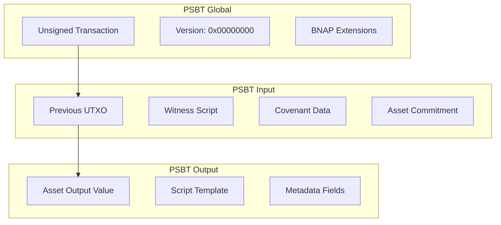
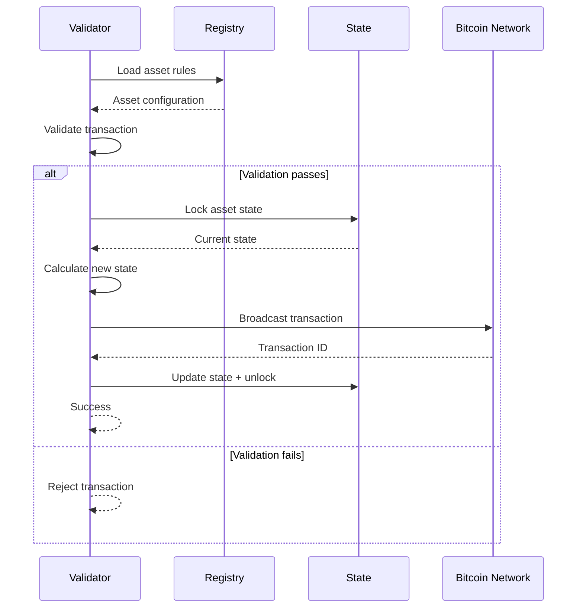

# BNAP Protocol Specification

This document defines the Bitcoin Native Asset Protocol (BNAP) format, transaction structures, and validation rules based on the actual implementation.

## Protocol Overview

BNAP implements a colored outputs protocol where digital assets are represented by Bitcoin UTXOs with embedded metadata. The protocol supports two primary asset types:

- **Fungible Tokens**: Divisible assets with configurable supply limits
- **Non-Fungible Tokens (NFTs)**: Unique digital collectibles with content binding

## Protocol Identifier

**Protocol Tag**: `BNAP` (0x424E4150)  
**Version**: 1  
**Magic Bytes**: `0x424E4150` followed by version byte

## Asset Types

### Fungible Asset Schema

```python
class FungibleAsset(BaseAsset):
    asset_type: Literal["fungible"]
    maximum_supply: int        # Hard cap on total supply
    per_mint_limit: int       # Maximum per transaction
    decimal_places: int       # Token precision (0-18)
```

**Rules:**
- `per_mint_limit <= maximum_supply`
- `decimal_places >= 0 and <= 18`
- Supply tracking prevents double-spending

### NFT Asset Schema

```python
class NFTAsset(BaseAsset):
    asset_type: Literal["nft"]
    collection_size: int      # Maximum NFTs in collection
    content_hash: str         # SHA-256 of content (optional)
    content_uri: str          # Content location (IPFS/HTTP)
    manifest_hash: str        # Collection manifest hash
```

**Rules:**
- Each token ID is unique within collection
- Content hash verification enforced
- Collection size is immutable after creation

## Transaction Structure

### PSBT Format (BIP-174)

BNAP transactions use Partially Signed Bitcoin Transaction format with protocol-specific extensions.



### Mint Transaction Format

#### Inputs

1. **Funding Input**: Provides Bitcoin for transaction fees and outputs
   - Script: Standard P2WPKH/P2WSH
   - Amount: Sufficient for fees + output values

2. **Control Input**: Authorizes asset operations (optional)
   - Script: P2WSH covenant or P2TR
   - Amount: Dust limit (546 sats)

#### Outputs

1. **Asset Output**: Contains the newly minted assets
   ```
   Value: 546 satoshis (dust limit)
   Script: P2WSH covenant or P2TR with asset commitment
   ```

2. **OP_RETURN Output**: Protocol metadata storage
   ```
   Value: 0 satoshis
   Script: OP_RETURN <protocol_data>
   ```

3. **Change Output**: Returns excess Bitcoin to issuer
   ```
   Value: funding_amount - fees - asset_outputs
   Script: Standard address format
   ```

## OP_RETURN Data Format

### Structure

```
OP_RETURN <protocol_tag> <version> <operation> <payload>
```

### Field Definitions

| Field | Size | Description |
|-------|------|-------------|
| Protocol Tag | 4 bytes | `BNAP` (0x424E4150) |
| Version | 1 byte | Protocol version (0x01) |
| Operation | 1 byte | Operation type |
| Payload | Variable | Operation-specific data |

### Operation Types

| Value | Operation | Description |
|-------|-----------|-------------|
| 0x01 | FUNGIBLE_MINT | Mint fungible tokens |
| 0x02 | NFT_MINT | Mint NFT |
| 0x03 | TRANSFER | Transfer assets |
| 0x04 | BURN | Burn assets |

### Fungible Mint Payload

```
<asset_id> <amount> <recipient> [allowlist_proof]
```

| Field | Size | Description |
|-------|------|-------------|
| Asset ID | 32 bytes | SHA-256 asset identifier |
| Amount | 8 bytes | Token amount (little-endian) |
| Recipient | 20 bytes | Recipient address hash |
| Allowlist Proof | Variable | Merkle proof (if required) |

### NFT Mint Payload

```
<asset_id> <token_id> <content_hash> <recipient>
```

| Field | Size | Description |
|-------|------|-------------|
| Asset ID | 32 bytes | Collection identifier |
| Token ID | 4 bytes | Unique token number |
| Content Hash | 32 bytes | SHA-256 of content |
| Recipient | 20 bytes | Recipient address hash |

## Covenant Scripts

### P2WSH Covenant Implementation

The P2WSH covenant enforces asset rules through witness script validation:

```python
def create_p2wsh_covenant(asset_id: bytes, validator_pubkey: bytes) -> bytes:
    """
    Create P2WSH covenant script for asset control.
    
    Script Logic:
    1. Verify asset ID in witness stack
    2. Check supply limits against registry
    3. Validate amount constraints  
    4. Verify validator signature
    """
    return [
        # Asset ID verification
        OP_DUP,                    # Duplicate asset ID
        asset_id,                  # Expected asset ID
        OP_EQUALVERIFY,            # Verify match
        
        # Amount validation (implement in witness)
        OP_SWAP,                   # Move amount to top
        OP_DUP,                    # Duplicate amount
        OP_SIZE,                   # Check size is 8 bytes
        b'\x08',                   # Expected size
        OP_EQUALVERIFY,            # Verify size
        
        # Supply limit check (handled by validator)
        # Validator must verify current_supply + amount <= max_supply
        
        # Validator signature verification
        validator_pubkey,          # Validator public key
        OP_CHECKSIG                # Verify signature
    ]
```

**Witness Stack:**
```
<validator_signature>
<asset_amount>
<asset_id>
<covenant_script>
```

### Taproot Covenant Implementation

Taproot covenants use key path spending with asset commitments:

```python
def create_taproot_commitment(internal_key: bytes, asset_data: bytes) -> bytes:
    """
    Create Taproot output key with asset commitment.
    
    Formula: P = P_internal + H(tag, asset_data) * G
    """
    # Tagged hash for asset commitment
    tag = b"BNAP/asset/v1"
    commitment_hash = tagged_hash(tag, asset_data)
    
    # Point addition: internal_key + commitment_point
    commitment_point = commitment_hash * G
    output_key = internal_key + commitment_point
    
    return output_key
```

**Asset Data Format:**
```python
asset_data = asset_id + amount.to_bytes(8, 'little') + operation_type
```

## Validation Rules

### Supply Limit Validation

```python
class SupplyLimitRule(ValidationRule):
    def validate(self, context: ValidationContext) -> bool:
        asset = context.registry.get_asset(context.asset_id)
        current_supply = context.registry.get_current_supply(context.asset_id)
        
        if asset.asset_type == AssetType.FUNGIBLE:
            new_supply = current_supply + context.amount
            if new_supply > asset.maximum_supply:
                context.add_error("supply_limit", 
                    f"Exceeds maximum supply: {new_supply} > {asset.maximum_supply}")
                return False
        
        return True
```

### Mint Limit Validation

```python
class MintLimitRule(ValidationRule):
    def validate(self, context: ValidationContext) -> bool:
        asset = context.registry.get_asset(context.asset_id)
        
        if asset.asset_type == AssetType.FUNGIBLE:
            if context.amount > asset.per_mint_limit:
                context.add_error("mint_limit",
                    f"Exceeds per-mint limit: {context.amount} > {asset.per_mint_limit}")
                return False
        
        return True
```

### Allowlist Validation

```python
class AllowlistRule(ValidationRule):
    def validate(self, context: ValidationContext) -> bool:
        asset = context.registry.get_asset(context.asset_id)
        
        if asset.allowlist_root:
            recipient = context.recipient_address
            proof = context.allowlist_proof
            
            if not verify_merkle_proof(recipient, proof, asset.allowlist_root):
                context.add_error("allowlist", 
                    f"Address {recipient} not in allowlist")
                return False
        
        return True
```

### Content Hash Validation

```python
class ContentHashRule(ValidationRule):
    def validate(self, context: ValidationContext) -> bool:
        if context.asset_type == AssetType.NFT:
            asset = context.registry.get_asset(context.asset_id)
            
            if asset.content_hash and context.content_hash:
                if asset.content_hash != context.content_hash:
                    context.add_error("content_hash",
                        f"Content hash mismatch")
                    return False
        
        return True
```

## Asset State Management

### State Tracking

```python
@dataclass
class StateEntry:
    asset_id: str
    minted_supply: int = 0
    last_mint_timestamp: Optional[datetime] = None
    transaction_count: int = 0
    transaction_history: List[TransactionEntry] = field(default_factory=list)
    issued_nft_ids: List[int] = field(default_factory=list)
```

### State Updates



## Registry Format

### JSON Schema

```json
{
  "metadata": {
    "version": "1.0.0",
    "created_at": "2024-01-01T00:00:00Z",
    "updated_at": "2024-01-01T00:00:00Z",
    "network": "regtest"
  },
  "validators": {
    "validator_1": {
      "validator_id": "bnap_validator_v1",
      "pubkey": "0x...",
      "signing_scheme": "schnorr",
      "permissions": ["mint", "transfer"],
      "is_active": true
    }
  },
  "assets": {
    "asset_id_hex": {
      "asset_id": "abc123...",
      "name": "Sample Token",
      "symbol": "SMPL",
      "asset_type": "fungible",
      "maximum_supply": 1000000,
      "per_mint_limit": 10000,
      "script_format": "p2tr",
      "issuer_pubkey": "0x...",
      "allowlist_root": null
    }
  },
  "state": {
    "asset_id_hex": {
      "asset_id": "abc123...",
      "minted_supply": 5000,
      "transaction_count": 5,
      "issued_nft_ids": []
    }
  }
}
```

## Merkle Proof Format

### Allowlist Proofs

```python
@dataclass
class MerkleProof:
    leaf: bytes          # Address hash being proven
    proof_path: List[bytes]  # Sibling hashes from leaf to root
    leaf_index: int      # Position in tree (for verification)

def verify_merkle_proof(leaf: bytes, proof: MerkleProof, root: bytes) -> bool:
    current_hash = leaf
    
    for i, sibling_hash in enumerate(proof.proof_path):
        # Determine hash order based on leaf index
        bit = (proof.leaf_index >> i) & 1
        
        if bit == 0:
            current_hash = sha256(current_hash + sibling_hash)
        else:
            current_hash = sha256(sibling_hash + current_hash)
    
    return current_hash == root
```

### Proof Generation

```python
def generate_allowlist_proof(addresses: List[str], target_address: str) -> MerkleProof:
    """Generate Merkle proof for address in allowlist."""
    # Build Merkle tree
    leaves = [sha256(addr.encode()) for addr in addresses]
    tree = build_merkle_tree(leaves)
    
    # Find target leaf
    target_leaf = sha256(target_address.encode())
    leaf_index = leaves.index(target_leaf)
    
    # Generate proof path
    proof_path = []
    current_index = leaf_index
    
    for level in tree[:-1]:  # Exclude root level
        sibling_index = current_index ^ 1  # XOR with 1 to get sibling
        if sibling_index < len(level):
            proof_path.append(level[sibling_index])
        current_index //= 2
    
    return MerkleProof(target_leaf, proof_path, leaf_index)
```

## Error Handling

### Validation Error Codes

| Code | Description | Resolution |
|------|-------------|------------|
| INVALID_ASSET_ID | Asset not found in registry | Register asset first |
| SUPPLY_EXCEEDED | Mint would exceed maximum supply | Reduce mint amount |
| MINT_LIMIT_EXCEEDED | Amount exceeds per-mint limit | Split into multiple mints |
| ALLOWLIST_VIOLATION | Address not in allowlist | Add to allowlist or use different address |
| CONTENT_HASH_MISMATCH | NFT content hash doesn't match | Update content or hash |
| INSUFFICIENT_BALANCE | Not enough Bitcoin for fees | Add more funding inputs |
| DUPLICATE_NFT_ID | NFT token ID already issued | Use different token ID |

### Error Response Format

```json
{
  "status": "error",
  "error_code": "SUPPLY_EXCEEDED",
  "message": "Mint amount would exceed maximum supply",
  "details": {
    "asset_id": "abc123...",
    "requested_amount": 15000,
    "current_supply": 990000,
    "maximum_supply": 1000000,
    "available_supply": 10000
  },
  "timestamp": "2024-01-01T12:00:00Z",
  "validator_id": "bnap_validator_v1"
}
```

## Network Compatibility

### Bitcoin Networks

| Network | Purpose | RPC Port | Address Prefix |
|---------|---------|----------|----------------|
| Mainnet | Production | 8332 | 1, 3, bc1 |
| Testnet | Public testing | 18332 | m, n, 2, tb1 |
| Regtest | Development | 18443 | m, n, 2, bcrt1 |

### Node Requirements

- **Bitcoin Core 24.0+**: Taproot support required
- **Mempool space**: For tracking unconfirmed transactions  
- **RPC access**: For transaction broadcasting and queries
- **Witness data**: Full witness transaction support

This protocol specification ensures compatibility with standard Bitcoin infrastructure while enabling rich asset functionality through careful covenant design and metadata encoding.