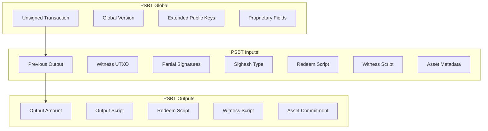

# Transaction Formats and Structure

This document details the transaction formats, PSBT construction, and encoding schemes used in BNAP, based on the implementation in the `psbt/` module.

## Transaction Types

BNAP supports several transaction types, each with specific input/output patterns:

- **Fungible Mint**: Create new fungible tokens
- **NFT Mint**: Create unique non-fungible tokens  
- **Transfer**: Move assets between addresses
- **Burn**: Destroy existing assets
- **Freeze/Unfreeze**: Temporarily disable asset operations

## PSBT Architecture (`psbt/builder.py`)

### PSBT Structure Overview



### PSBT Key Types

```python
class PSBTKeyType(Enum):
    """PSBT key types as defined in BIP-174 with BNAP extensions."""
    
    # Global types
    PSBT_GLOBAL_UNSIGNED_TX = 0x00
    PSBT_GLOBAL_XPUB = 0x01
    PSBT_GLOBAL_VERSION = 0xfb
    PSBT_GLOBAL_PROPRIETARY = 0xfc
    
    # Input types
    PSBT_IN_NON_WITNESS_UTXO = 0x00
    PSBT_IN_WITNESS_UTXO = 0x01
    PSBT_IN_PARTIAL_SIG = 0x02
    PSBT_IN_SIGHASH_TYPE = 0x03
    PSBT_IN_REDEEM_SCRIPT = 0x04
    PSBT_IN_WITNESS_SCRIPT = 0x05
    PSBT_IN_BIP32_DERIVATION = 0x06
    PSBT_IN_FINAL_SCRIPTSIG = 0x07
    PSBT_IN_FINAL_SCRIPTWITNESS = 0x08
    PSBT_IN_PROPRIETARY = 0xfc
    
    # Output types
    PSBT_OUT_REDEEM_SCRIPT = 0x00
    PSBT_OUT_WITNESS_SCRIPT = 0x01
    PSBT_OUT_BIP32_DERIVATION = 0x02
    PSBT_OUT_PROPRIETARY = 0xfc
    
    # BNAP proprietary types
    BNAP_ASSET_ID = 0x00
    BNAP_ASSET_AMOUNT = 0x01
    BNAP_OPERATION_TYPE = 0x02
    BNAP_CONTENT_HASH = 0x03
    BNAP_ALLOWLIST_PROOF = 0x04
```

## Fungible Token Transactions

### Mint Transaction Structure

```python
class FungibleMintPSBT:
    """PSBT builder for fungible token minting."""
    
    def __init__(self, asset_config: FungibleAsset, validator_key: PrivateKey):
        self.asset_config = asset_config
        self.validator_key = validator_key
        self.psbt = PSBT()
        
    def create_mint_transaction(self, mint_request: FungibleMintRequest) -> PSBT:
        """Create PSBT for fungible token mint."""
        
        # Add funding input
        funding_input = self._create_funding_input(mint_request.funding_utxo)
        self.psbt.add_input(funding_input)
        
        # Add control input (if required)
        if self.asset_config.script_format == ScriptFormat.P2WSH:
            control_input = self._create_control_input(mint_request.control_utxo)
            self.psbt.add_input(control_input)
        
        # Add asset output
        asset_output = self._create_asset_output(mint_request)
        self.psbt.add_output(asset_output)
        
        # Add OP_RETURN output
        op_return_output = self._create_op_return_output(mint_request)
        self.psbt.add_output(op_return_output)
        
        # Add change output
        change_output = self._create_change_output(mint_request)
        if change_output.value > 546:  # Above dust limit
            self.psbt.add_output(change_output)
        
        return self.psbt
    
    def _create_asset_output(self, mint_request: FungibleMintRequest) -> PSBTOutput:
        """Create asset output with commitment."""
        
        if self.asset_config.script_format == ScriptFormat.P2TR:
            # Taproot asset commitment
            commitment = AssetCommitment(
                asset_id=bytes.fromhex(self.asset_config.asset_id),
                amount=mint_request.amount,
                operation=OperationType.MINT,
                nonce=mint_request.nonce,
                metadata=mint_request.metadata or b""
            )
            
            taproot_output = create_taproot_commitment(
                mint_request.recipient_internal_key,
                commitment
            )
            
            output_script = bytes([OP_1, 0x20]) + taproot_output.output_key
            
        else:  # P2WSH
            # Create covenant script
            covenant_script = create_p2wsh_covenant(
                bytes.fromhex(self.asset_config.asset_id),
                self.validator_key.public_key.compressed
            )
            
            script_hash = hashlib.sha256(covenant_script).digest()
            output_script = bytes([OP_0, 0x20]) + script_hash
        
        return PSBTOutput(
            value=546,  # Dust limit
            script=output_script,
            witness_script=covenant_script if self.asset_config.script_format == ScriptFormat.P2WSH else None,
            proprietary_data={
                BNAP_ASSET_ID: bytes.fromhex(self.asset_config.asset_id),
                BNAP_ASSET_AMOUNT: mint_request.amount.to_bytes(8, 'little'),
                BNAP_OPERATION_TYPE: OperationType.MINT.value.encode('utf-8')
            }
        )
    
    def _create_op_return_output(self, mint_request: FungibleMintRequest) -> PSBTOutput:
        """Create OP_RETURN output with protocol metadata."""
        
        # BNAP protocol header
        protocol_data = b'BNAP'  # Protocol identifier
        protocol_data += b'\x01'  # Version
        protocol_data += b'\x01'  # Operation: FUNGIBLE_MINT
        
        # Asset data
        protocol_data += bytes.fromhex(self.asset_config.asset_id)  # Asset ID
        protocol_data += mint_request.amount.to_bytes(8, 'little')  # Amount
        protocol_data += mint_request.recipient_hash  # Recipient (20 bytes)
        
        # Allowlist proof (if required)
        if mint_request.allowlist_proof:
            proof_data = self._serialize_allowlist_proof(mint_request.allowlist_proof)
            protocol_data += len(proof_data).to_bytes(2, 'little')
            protocol_data += proof_data
        else:
            protocol_data += b'\x00\x00'  # No proof
        
        # Create OP_RETURN script
        op_return_script = bytes([OP_RETURN, len(protocol_data)]) + protocol_data
        
        return PSBTOutput(
            value=0,
            script=op_return_script
        )
```

### Fungible Transfer Transaction

```python
def create_fungible_transfer(from_utxo: UTXO, to_address: str, 
                           amount: int, change_address: str) -> PSBT:
    """Create transfer transaction for fungible tokens."""
    
    psbt = PSBT()
    
    # Input: Current asset UTXO
    asset_input = PSBTInput(
        previous_txid=from_utxo.txid,
        output_index=from_utxo.vout,
        witness_utxo=from_utxo.to_witness_utxo(),
        witness_script=from_utxo.witness_script,
        proprietary_data={
            BNAP_ASSET_ID: from_utxo.asset_id,
            BNAP_ASSET_AMOUNT: from_utxo.asset_amount.to_bytes(8, 'little')
        }
    )
    psbt.add_input(asset_input)
    
    # Output 1: Transfer amount to recipient
    recipient_output = PSBTOutput(
        value=546,
        script=address_to_script(to_address),
        proprietary_data={
            BNAP_ASSET_ID: from_utxo.asset_id,
            BNAP_ASSET_AMOUNT: amount.to_bytes(8, 'little'),
            BNAP_OPERATION_TYPE: OperationType.TRANSFER.value.encode('utf-8')
        }
    )
    psbt.add_output(recipient_output)
    
    # Output 2: Change back to sender (if any)
    change_amount = from_utxo.asset_amount - amount
    if change_amount > 0:
        change_output = PSBTOutput(
            value=546,
            script=address_to_script(change_address),
            proprietary_data={
                BNAP_ASSET_ID: from_utxo.asset_id,
                BNAP_ASSET_AMOUNT: change_amount.to_bytes(8, 'little'),
                BNAP_OPERATION_TYPE: OperationType.TRANSFER.value.encode('utf-8')
            }
        )
        psbt.add_output(change_output)
    
    # OP_RETURN with transfer metadata
    op_return_data = create_transfer_op_return(from_utxo.asset_id, amount, to_address)
    op_return_output = PSBTOutput(value=0, script=op_return_data)
    psbt.add_output(op_return_output)
    
    return psbt
```

## NFT Transactions

### NFT Mint Structure

```python
class NFTMintPSBT:
    """PSBT builder for NFT minting."""
    
    def create_nft_mint(self, mint_request: NFTMintRequest) -> PSBT:
        """Create PSBT for NFT mint."""
        
        psbt = PSBT()
        
        # Funding input
        funding_input = self._create_funding_input(mint_request.funding_utxo)
        psbt.add_input(funding_input)
        
        # NFT output (always unique)
        nft_output = self._create_nft_output(mint_request)
        psbt.add_output(nft_output)
        
        # OP_RETURN with NFT metadata
        op_return_output = self._create_nft_op_return(mint_request)
        psbt.add_output(op_return_output)
        
        # Change output
        change_output = self._create_change_output(mint_request)
        if change_output.value > 546:
            psbt.add_output(change_output)
        
        return psbt
    
    def _create_nft_output(self, mint_request: NFTMintRequest) -> PSBTOutput:
        """Create NFT output with unique token commitment."""
        
        # NFT commitment includes token ID and content hash
        nft_commitment = AssetCommitment(
            asset_id=bytes.fromhex(mint_request.collection_id),
            amount=1,  # NFTs always have amount = 1
            operation=OperationType.MINT,
            nonce=mint_request.token_id.to_bytes(4, 'little'),
            metadata=mint_request.content_hash
        )
        
        if mint_request.script_format == ScriptFormat.P2TR:
            taproot_output = create_taproot_commitment(
                mint_request.recipient_internal_key,
                nft_commitment
            )
            output_script = bytes([OP_1, 0x20]) + taproot_output.output_key
        else:
            # P2WSH NFT covenant
            nft_script = create_nft_covenant_script(
                bytes.fromhex(mint_request.collection_id),
                mint_request.token_id,
                mint_request.content_hash
            )
            script_hash = hashlib.sha256(nft_script).digest()
            output_script = bytes([OP_0, 0x20]) + script_hash
        
        return PSBTOutput(
            value=546,
            script=output_script,
            proprietary_data={
                BNAP_ASSET_ID: bytes.fromhex(mint_request.collection_id),
                BNAP_ASSET_AMOUNT: b'\x01\x00\x00\x00\x00\x00\x00\x00',  # Amount = 1
                BNAP_OPERATION_TYPE: OperationType.MINT.value.encode('utf-8'),
                BNAP_CONTENT_HASH: mint_request.content_hash
            }
        )
    
    def _create_nft_op_return(self, mint_request: NFTMintRequest) -> PSBTOutput:
        """Create OP_RETURN with NFT metadata."""
        
        # NFT-specific OP_RETURN format
        op_return_data = b'BNAP'  # Protocol
        op_return_data += b'\x01'  # Version
        op_return_data += b'\x02'  # Operation: NFT_MINT
        
        op_return_data += bytes.fromhex(mint_request.collection_id)  # Collection ID
        op_return_data += mint_request.token_id.to_bytes(4, 'little')  # Token ID
        op_return_data += mint_request.content_hash  # Content hash (32 bytes)
        op_return_data += mint_request.recipient_hash  # Recipient (20 bytes)
        
        op_return_script = bytes([OP_RETURN, len(op_return_data)]) + op_return_data
        
        return PSBTOutput(value=0, script=op_return_script)
```

### NFT Transfer

```python
def create_nft_transfer(nft_utxo: UTXO, to_address: str) -> PSBT:
    """Create NFT transfer transaction."""
    
    psbt = PSBT()
    
    # Input: NFT UTXO
    nft_input = PSBTInput(
        previous_txid=nft_utxo.txid,
        output_index=nft_utxo.vout,
        witness_utxo=nft_utxo.to_witness_utxo(),
        witness_script=nft_utxo.witness_script,
        proprietary_data={
            BNAP_ASSET_ID: nft_utxo.asset_id,
            BNAP_ASSET_AMOUNT: b'\x01\x00\x00\x00\x00\x00\x00\x00',
            BNAP_CONTENT_HASH: nft_utxo.content_hash
        }
    )
    psbt.add_input(nft_input)
    
    # Output: NFT to new owner
    transfer_output = PSBTOutput(
        value=546,
        script=address_to_script(to_address),
        proprietary_data={
            BNAP_ASSET_ID: nft_utxo.asset_id,
            BNAP_ASSET_AMOUNT: b'\x01\x00\x00\x00\x00\x00\x00\x00',
            BNAP_OPERATION_TYPE: OperationType.TRANSFER.value.encode('utf-8'),
            BNAP_CONTENT_HASH: nft_utxo.content_hash
        }
    )
    psbt.add_output(transfer_output)
    
    # OP_RETURN with transfer record
    op_return_data = create_nft_transfer_op_return(
        nft_utxo.asset_id,
        nft_utxo.token_id,
        to_address
    )
    op_return_output = PSBTOutput(value=0, script=op_return_data)
    psbt.add_output(op_return_output)
    
    return psbt
```

## PSBT Parsing (`psbt/parser.py`)

### PSBT Decoder

```python
class PSBTParser:
    """Parser for PSBT format with BNAP extensions."""
    
    def parse(self, psbt_base64: str) -> Dict[str, Any]:
        """Parse PSBT from base64 encoding."""
        
        try:
            psbt_bytes = base64.b64decode(psbt_base64)
        except Exception as e:
            raise PSBTError(f"Invalid base64 encoding: {e}")
        
        # Check PSBT magic bytes
        if not psbt_bytes.startswith(b'psbt\xff'):
            raise PSBTError("Invalid PSBT magic bytes")
        
        psbt_data = psbt_bytes[5:]  # Skip magic
        return self._parse_psbt_data(psbt_data)
    
    def _parse_psbt_data(self, data: bytes) -> Dict[str, Any]:
        """Parse PSBT binary data."""
        
        reader = BytesIO(data)
        result = {
            'global': {},
            'inputs': [],
            'outputs': []
        }
        
        # Parse global section
        result['global'] = self._parse_global_section(reader)
        
        # Parse input sections
        input_count = len(result['global']['unsigned_tx']['inputs'])
        for i in range(input_count):
            input_data = self._parse_input_section(reader)
            result['inputs'].append(input_data)
        
        # Parse output sections
        output_count = len(result['global']['unsigned_tx']['outputs'])
        for i in range(output_count):
            output_data = self._parse_output_section(reader)
            result['outputs'].append(output_data)
        
        return result
    
    def _parse_key_value_pairs(self, reader: BytesIO) -> Dict[int, Any]:
        """Parse key-value pairs from PSBT section."""
        
        pairs = {}
        
        while True:
            # Read key length
            key_len = self._read_compact_size(reader)
            if key_len == 0:
                break  # End of section
            
            # Read key
            key_data = reader.read(key_len)
            if len(key_data) != key_len:
                raise PSBTError("Unexpected end of data")
            
            key_type = key_data[0]
            key_value = key_data[1:] if len(key_data) > 1 else b''
            
            # Read value length and value
            value_len = self._read_compact_size(reader)
            value_data = reader.read(value_len)
            if len(value_data) != value_len:
                raise PSBTError("Unexpected end of data")
            
            pairs[key_type] = {
                'key': key_value,
                'value': value_data
            }
        
        return pairs
    
    def _extract_bnap_data(self, pairs: Dict[int, Any]) -> Dict[str, Any]:
        """Extract BNAP-specific data from proprietary fields."""
        
        bnap_data = {}
        
        # Look for proprietary fields
        if PSBTKeyType.PSBT_IN_PROPRIETARY.value in pairs:
            prop_data = pairs[PSBTKeyType.PSBT_IN_PROPRIETARY.value]['value']
            
            # BNAP proprietary format: <identifier><subtype><data>
            if prop_data.startswith(b'BNAP'):
                subtype = prop_data[4]
                data = prop_data[5:]
                
                if subtype == BNAP_ASSET_ID:
                    bnap_data['asset_id'] = data.hex()
                elif subtype == BNAP_ASSET_AMOUNT:
                    bnap_data['asset_amount'] = int.from_bytes(data, 'little')
                elif subtype == BNAP_OPERATION_TYPE:
                    bnap_data['operation_type'] = data.decode('utf-8').rstrip('\x00')
                elif subtype == BNAP_CONTENT_HASH:
                    bnap_data['content_hash'] = data.hex()
                elif subtype == BNAP_ALLOWLIST_PROOF:
                    bnap_data['allowlist_proof'] = self._parse_allowlist_proof(data)
        
        return bnap_data
```

### Transaction Analysis

```python
def analyze_transaction_type(psbt_data: Dict[str, Any]) -> TransactionType:
    """Analyze PSBT to determine transaction type."""
    
    # Check OP_RETURN outputs for protocol data
    for output in psbt_data['outputs']:
        script = output.get('script', b'')
        
        if script.startswith(bytes([OP_RETURN])):
            op_return_data = script[2:]  # Skip OP_RETURN and length
            
            if op_return_data.startswith(b'BNAP\x01'):  # BNAP protocol v1
                operation_byte = op_return_data[5]
                
                if operation_byte == 0x01:
                    return TransactionType.FUNGIBLE_MINT
                elif operation_byte == 0x02:
                    return TransactionType.NFT_MINT
                elif operation_byte == 0x03:
                    return TransactionType.TRANSFER
                elif operation_byte == 0x04:
                    return TransactionType.BURN
    
    # Check for asset data in proprietary fields
    for input_data in psbt_data['inputs']:
        bnap_data = input_data.get('bnap', {})
        if bnap_data:
            # Has asset data, likely a transfer
            return TransactionType.TRANSFER
    
    return TransactionType.UNKNOWN

def extract_asset_operations(psbt_data: Dict[str, Any]) -> List[AssetOperation]:
    """Extract all asset operations from PSBT."""
    
    operations = []
    
    # Extract from OP_RETURN data
    for i, output in enumerate(psbt_data['outputs']):
        script = output.get('script', b'')
        
        if script.startswith(bytes([OP_RETURN])) and len(script) > 6:
            op_return_data = script[2:]
            
            if op_return_data.startswith(b'BNAP\x01'):
                operation = self._parse_op_return_operation(op_return_data)
                operation.output_index = i
                operations.append(operation)
    
    # Extract from proprietary fields
    for i, input_data in enumerate(psbt_data['inputs']):
        bnap_data = input_data.get('bnap', {})
        if bnap_data.get('asset_id'):
            operation = AssetOperation(
                type=OperationType(bnap_data.get('operation_type', 'transfer')),
                asset_id=bnap_data['asset_id'],
                amount=bnap_data.get('asset_amount', 0),
                input_index=i
            )
            operations.append(operation)
    
    return operations
```

## Transaction Validation (`psbt/validator.py`)

### PSBT Validation

```python
class PSBTValidator:
    """Validates PSBT structure and BNAP-specific rules."""
    
    def validate_psbt(self, psbt_data: Dict[str, Any]) -> ValidationResult:
        """Comprehensive PSBT validation."""
        
        errors = []
        warnings = []
        
        # Basic PSBT structure validation
        try:
            self._validate_psbt_structure(psbt_data)
        except ValidationError as e:
            errors.append(f"PSBT structure: {e}")
        
        # Transaction format validation
        try:
            self._validate_transaction_format(psbt_data)
        except ValidationError as e:
            errors.append(f"Transaction format: {e}")
        
        # BNAP-specific validation
        try:
            asset_operations = extract_asset_operations(psbt_data)
            for operation in asset_operations:
                self._validate_asset_operation(operation, psbt_data)
        except ValidationError as e:
            errors.append(f"Asset operation: {e}")
        
        # Fee validation
        try:
            fee_info = self._validate_transaction_fees(psbt_data)
            if fee_info['fee_rate'] < 1.0:  # sat/byte
                warnings.append(f"Low fee rate: {fee_info['fee_rate']:.1f} sat/byte")
        except ValidationError as e:
            errors.append(f"Fee validation: {e}")
        
        return ValidationResult(
            valid=len(errors) == 0,
            errors=errors,
            warnings=warnings,
            transaction_type=analyze_transaction_type(psbt_data),
            asset_operations=asset_operations
        )
    
    def _validate_transaction_format(self, psbt_data: Dict[str, Any]):
        """Validate transaction follows BNAP format requirements."""
        
        unsigned_tx = psbt_data['global']['unsigned_tx']
        
        # Check for required OP_RETURN output
        has_op_return = False
        for output in unsigned_tx['outputs']:
            if output['script'].startswith(bytes([OP_RETURN])):
                has_op_return = True
                
                # Validate OP_RETURN size
                if len(output['script']) > 83:  # 80 bytes data + 3 overhead
                    raise ValidationError("OP_RETURN output too large")
                
                break
        
        if not has_op_return:
            raise ValidationError("Missing required OP_RETURN output")
        
        # Check output values meet dust limits
        for i, output in enumerate(unsigned_tx['outputs']):
            if output['value'] > 0 and output['value'] < 546:
                raise ValidationError(f"Output {i} below dust limit: {output['value']} < 546")
    
    def _validate_asset_operation(self, operation: AssetOperation, psbt_data: Dict[str, Any]):
        """Validate individual asset operation."""
        
        if operation.type == OperationType.MINT:
            self._validate_mint_operation(operation, psbt_data)
        elif operation.type == OperationType.TRANSFER:
            self._validate_transfer_operation(operation, psbt_data)
        elif operation.type == OperationType.BURN:
            self._validate_burn_operation(operation, psbt_data)
        else:
            raise ValidationError(f"Unknown operation type: {operation.type}")
    
    def _validate_mint_operation(self, operation: AssetOperation, psbt_data: Dict[str, Any]):
        """Validate mint operation specific rules."""
        
        # Check amount is positive
        if operation.amount <= 0:
            raise ValidationError("Mint amount must be positive")
        
        # Validate asset ID format
        if len(operation.asset_id) != 64:  # 32 bytes hex
            raise ValidationError("Invalid asset ID length")
        
        # Check for proper output commitment
        if operation.output_index is not None:
            output = psbt_data['outputs'][operation.output_index]
            if not self._has_valid_asset_commitment(output, operation):
                raise ValidationError("Invalid asset commitment in output")
```

## Fee Calculation

### Dynamic Fee Estimation

```python
def calculate_transaction_fee(psbt_data: Dict[str, Any], fee_rate: float) -> int:
    """Calculate transaction fee based on size and fee rate."""
    
    # Estimate transaction size
    tx_size = estimate_transaction_size(psbt_data)
    
    # Calculate fee: size * fee_rate
    fee_satoshis = int(tx_size * fee_rate)
    
    # Minimum fee check
    min_fee = 1000  # 1000 satoshis minimum
    return max(fee_satoshis, min_fee)

def estimate_transaction_size(psbt_data: Dict[str, Any]) -> int:
    """Estimate final transaction size in bytes."""
    
    unsigned_tx = psbt_data['global']['unsigned_tx']
    
    # Base transaction size
    size = 10  # Version (4) + input count (1-9) + output count (1-9) + locktime (4)
    
    # Input sizes
    for i, tx_input in enumerate(unsigned_tx['inputs']):
        psbt_input = psbt_data['inputs'][i]
        
        if 'witness_script' in psbt_input:
            # P2WSH input: 41 bytes + witness size
            size += 41
            size += estimate_witness_size(psbt_input)
        elif 'witness_utxo' in psbt_input:
            # P2WPKH input: 68 bytes + 27 witness bytes
            size += 68 + 27
        else:
            # Legacy input: ~150 bytes average
            size += 150
    
    # Output sizes
    for output in unsigned_tx['outputs']:
        script_len = len(output['script'])
        size += 8 + 1 + script_len  # value (8) + script_len (1-9) + script
    
    return size

def estimate_witness_size(psbt_input: Dict[str, Any]) -> int:
    """Estimate witness stack size for input."""
    
    witness_size = 1  # Stack item count
    
    # Signature: ~72 bytes
    witness_size += 1 + 72
    
    # Witness script
    if 'witness_script' in psbt_input:
        script_len = len(psbt_input['witness_script'])
        witness_size += compact_size_len(script_len) + script_len
    
    # Additional stack items for BNAP (asset data, proofs)
    bnap_data = psbt_input.get('bnap', {})
    if bnap_data:
        # Asset commitment data: ~64 bytes
        witness_size += 1 + 64
        
        # Allowlist proof: variable size
        if 'allowlist_proof' in bnap_data:
            proof_size = len(bnap_data['allowlist_proof']) * 32  # 32 bytes per proof element
            witness_size += compact_size_len(proof_size) + proof_size
    
    return witness_size
```

This transaction format specification ensures BNAP transactions are properly structured, validated, and compatible with Bitcoin's consensus rules while encoding rich asset metadata through covenant scripts and OP_RETURN data.